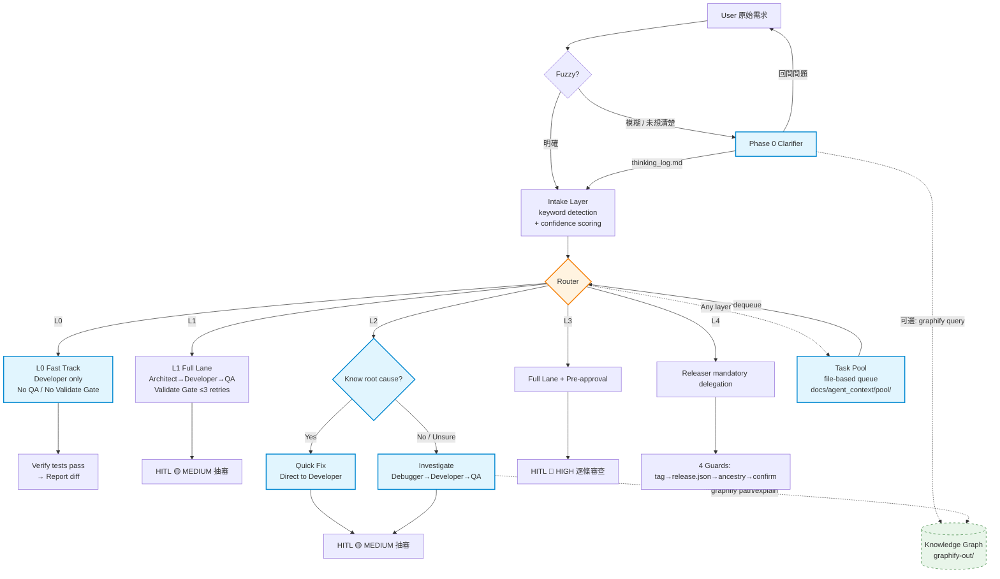
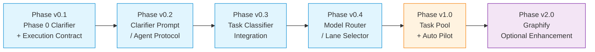

# Agent Workflow Framework — 開發路線圖

> 狀態: 規劃階段 v0 · 最後更新: 2026-07-12
> 產出依據: 開發習慣量化分析（854 sessions, 225 commits）+ 架構討論

---

## 一、你的開發者畫像（數據總結）

| 維度 | 數值 |
|:-----|:------|
| **工作量分布** | L0 配置 ~40%, L2 修 bug ~30%, L1 功能 ~15%, L4 發布 ~10%, L3 重構 ~5% |
| **工作型態** | 78.7% session < 30 則 — 任務切碎型開發者 |
| **時區** | UTC+8 台灣，高峰 10-12 / 16-18 |
| **Agent 委派** | 5,749 developer / 4,542 releaser / 1,808 qa / 弱勢: 21 debugger |
| **專案數** | 8+ 活躍專案，以 company-profile-optimizer 為主 |
| **成本** | $680.52 / 4mo, 557M input tokens |

**核心瓶頸**: 啟動前需想清楚 → 認知負荷集中在「模糊→清晰」的轉換階段。
**次要瓶頸**: L0/L2 佔 70% 工作量但走完整 Validate Gate → 流程過重。

---

## 二、完整架構總圖



---

## 三、Layer 定義（完整版）

### L0 — 配置 & 雜務（Config & Housekeeping）

| 屬性 | 現狀 | 改造後 |
|:-----|:------|:--------|
| Git types | chore, docs, ci | 不變 |
| 風險 | 🟢 LOW | 不變 |
| HITL | Auto-approve | 不變（prod config 例外） |
| 流程 | Architect→Developer→QA | **L0 Fast Track: Developer only** |
| QA Gate | 有（過重） | **無** |
| 測試要求 | 不需新測試 | 不變 |
| 佔你工作量 | ~40% | 目標: 節省 30% 流程 overhead |

**Fast Track 流程**:
```
User: "bump version to 0.23.0"
  → Developer 讀取 release.json + CHANGELOG
  → 執行變更
  → python3 -m json.tool 驗證 JSON
  → 回報 diff
  → ✅ Done（無 QA, 無 Validate Gate, 無 HITL）
```

---

### L1 — 功能開發（Feature Development）

| 屬性 | 現狀 | 改造後 |
|:-----|:------|:--------|
| Git types | feat, Phase | 不變 |
| 風險 | 🟡 MEDIUM | 不變 |
| HITL | 抽審 Validate Report | 不變 |
| 流程 | Architect→Developer→QA | 不變（Phase 0 可做前置澄清） |
| QA Gate | 有 | 有（Validate Gate ≤ 3 retries） |
| 測試要求 | 新功能新增測試 | 不變 |
| 佔你工作量 | ~15% | 維持 |

---

### L2 — 除錯修復（Bug Fixing）

| 屬性 | 現狀 | 改造後 |
|:-----|:------|:--------|
| Git types | fix, Fix-NNN | 不變 |
| 風險 | 🟡 MEDIUM | 不變 |
| HITL | 抽審 Validate Report | 不變 |
| 流程 | Debugger→Developer→QA | **L2 Smart Path: 雙模式** |
| Debugger | 強制（但你只用 21 次） | **可選** |
| 佔你工作量 | ~30% | 目標: Quick Fix 節省 50% 時間 |

**Smart Path 雙模式**:

```
模式 A: Quick Fix 🔵
  觸發: 你已經知道 root cause
  流程: Developer → regression test → 抽審
  適合: threshold 調整、已知 bug 修復

模式 B: Investigate 🔴
  觸發: 不確定 root cause
  流程: Debugger (3 hypotheses) → Developer → QA → 抽審
  可選加速: graphify path/explain 輔助定位
  適合: 複雜 regression、跨模組 bug
```

---

### L3 — 重構架構（Refactoring）

| 屬性 | 值 |
|:-----|:----|
| Git types | refactor |
| 風險 | 🔴 HIGH |
| HITL | Pre-approval 逐條審查 |
| 流程 | Architect→Developer→QA（不變）|
| 佔你工作量 | ~5% |
| 設計 | 已有完善流程，維持現狀 |

---

### L4 — 發布部署（Release & Deployment）

| 屬性 | 值 |
|:-----|:----|
| Git types | Release |
| 風險 | 🔴 HIGH |
| HITL | Pre-approval + Releaser 強制委派 |
| 流程 | Releaser（Architect 不得執行）— 4 guards |
| 佔你工作量 | ~10% |
| 設計 | 已有完善流程（你 10 次 release 都走對），維持現狀 |

**4 Guards**:
1. `^v[0-9]+\.[0-9]+\.[0-9]+$` tag 格式
2. release.json tag 一致性
3. commit 祖先鏈在 origin/main 中
4. Human 確認字串（DEPLOY_PROD）

---

## 四、新增元件設計

### 4.1 Phase 0 Clarifier + Execution Contract

**目的**: 解決「啟動前需想清楚」的認知瓶頸。接受模糊/未成熟的點子，透過對話 drill-down 產出可交付給 Intake / Architect / Task Pool 的結構化執行契約。

> 注意: Phase 0 的核心是 **Clarifier + Execution Contract**，不是單純 classifier。  
> Classifier / recommended L-layer 只是 Phase 0 的輸出欄位之一。

```
位置: Intake Layer 之前（可選前置）
觸發: 使用者需求模糊 / confidence < 0.55 / 任務缺少完成標準或驗證方式
結束: 產出 thinking_log.md + Phase Execution Contract + 推薦 L-layer
```

**流程**:
```
Input: "我想要做一個品質檢查..."（模糊）
  → Step 1: 讀取相關檔案
    - git log 最近變更
    - 現有品質檢查架構（graphify query 可選加速）
  → Step 2: 問問題 drill-down
    - "你說的品質是 content quality 還是 search quality？"
    - "新的 check rule 還是調整現有 threshold？"
    - "影響到哪個 pipeline stage？"
  → Step 3: 產出 thinking_log.md（可中斷恢復）
  → Step 4: 產出 Phase Execution Contract
    - clarified_spec
    - scope_boundary
    - success_criteria
    - validation_plan
    - risk_level
    - recommended_layer
    - next_step
    - residual_ambiguity
  → 交給 Intake Layer
```

**儲存**: `docs/agent_context/thinking/{topic}_thinking.md`

**Graphify 整合**: 可選。當安裝了 graphify 時，Phase 0 可以先用 `graphify query "topic"` 取得跨檔案的知識圖譜，減少檔案讀取次數。

---

### 4.2 L0 Fast Track

**目的**: 解決 L0 任務（~40% 工作量）走完整 Validate Gate 的 overhead。

```
路由: User → Developer → Done
QA Gate: 無
HITL: 🟢 LOW auto-approve（prod config 例外）
驗證: 既有測試通過 + diff report
```

**禁止事項**: Fast Track 只適用於 L0 明確任務。如果 Developer 發現需要改動 source code 邏輯，必須升級為 L1/L2 流程。

---

### 4.3 L2 Smart Path

**目的**: 尊重你自己 debug 的習慣（只用 21 次 Debugger），同時保留完整的 Investigate 路徑給複雜 case。

```
路由: User 選擇 Quick Fix 或 Investigate
Quick Fix: Developer → regression test → 抽審
Investigate: Debugger → Developer → QA → 抽審
          （可選 graphify path/explain 輔助定位）
```

---

### 4.4 Task Pool

**目的**: 跨 session 任務佇列，解決「78.7% session < 30 則」反映的中斷/排隊問題。

```
位置: docs/agent_context/pool/
結構:
├── active.md           # 當前進行中
├── pending/            # 待處理佇列
│   ├── YYYY-MM-DD-topic.yaml
│   └── ...
├── completed/          # 已完成
└── pool.yaml           # 佇列狀態

任務 yaml 格式:
  id: pool-20260712-001
  title: "Fix audience drift false positive"
  layer: L2
  mode: quick_fix        # 或 investigate
  status: pending        # pending | active | completed | blocked
  clarified: true        # 是否通過 Phase 0
  created_at: 2026-07-12T10:30:00+08:00
  context_ref: docs/agent_context/thinking/audience-drift-thinking.md
```

**用法**:
- 開發中被中斷 → `pool add` → 下次 `pool list` → `pool pick`
- 突然想到小任務 → `pool add --layer L0` → 有空再處理
- Task Pool 中的任務可以指定 **priority** 和 **dependencies**

---

### 4.5 Graphify 知識圖譜（Optional Enhancement）

**目的**: 為 Phase 0（上下文理解）和 L2 Investigate（root cause 定位）提供加速。

```
安裝（每個專案一次）:
  uv tool install graphifyy
  graphify install --platform opencode
  cd <project> && graphify .

使用場景:
  Phase 0:     graphify query "quality check"        → 了解現有架構
  L2 Investigate: graphify path "false_positive" "QualityGate" → 追 code path
               graphify explain "no_audience_drift"   → 看節點詳細資訊

前置條件:
  - Python 3.10+
  - 每個專案需要先建立 graph（一次性 ~30 秒）
  - graphify-out/ 建議 commit 進 repo 讓團隊共享
```

---

## 五、HITL 模式總表

| Layer | 風險 | HITL 模式 | 說明 |
|:-----:|:----:|:---------|:------|
| L0 | 🟢 LOW | Auto-approve | CI 通過即核准（prod config 例外升 🟡） |
| L1 | 🟡 MEDIUM | 抽審 Validate Report | Architect 抽查 |
| L2 QF | 🟡 MEDIUM | 抽審 Validate Report | Quick Fix 模式 |
| L2 INV | 🟡 MEDIUM | 抽審 Validate Report | Investigate 模式 |
| L3 | 🔴 HIGH | Pre-approval 逐條審查 | Human 書面簽核 |
| L4 | 🔴 HIGH | Releaser 強制委派 + Pre-approval | Human 確認字串 (DEPLOY_PROD) |

---

## 六、開發優先順序



| Phase | 狀態 | 主要產出 / 下一步 |
|:------|:-----|:------------------|
| v0.1 — Phase 0 Clarifier + Execution Contract | ✅ Completed | `docs/agent_context/v0_1_phase_execution_contract/` |
| v0.2 — Clarifier Prompt / Agent Protocol | ✅ Completed | `clarifier_prompt.md`、`dry_run_cases.md`、`phase_handoff.md` |
| v0.3 — Task Classifier Integration | ✅ Completed | `classifier_handoff_spec.md`、`routing_map_update_strategy.md`、`integration_dry_run_cases.md`、`phase_handoff.md` |
| v0.4 — Model Router / Lane Selector | ✅ Completed | `lane_selector_spec.md`、`model_routing_strategy.md`、`lane_dry_run_cases.md`、`phase_handoff.md` |
| v1.0 — Task Pool + Auto Pilot | ✅ Completed | `task_pool_spec.md`、`auto_pilot_execution_policy.md`、`pool_dry_run_cases.md`、`phase_handoff.md` |
| v2.0 — Graphify Optional Enhancement | 🔜 Next | codebase graph 輔助 context gathering / root-cause tracing |

### Phase v0.1 — Phase 0 Clarifier + Execution Contract（建議優先）

| 項目 | 內容 |
|:-----|:------|
| **目標** | 建立 Phase 0 Clarifier 的運作協定、thinking_log.md template、Phase Execution Contract schema |
| **產出** | 協定文件、template、觸發條件、exit criteria、contract 欄位定義 |
| **不包含** | 程式碼實作、正式 classifier、Graphify 整合 |
| **預估** | 1-2 天 |
| **打通標準** | 可以對模糊需求執行 drill-down，產出 thinking_log.md 與可交給 Intake/Architect 的 Execution Contract |
| **狀態** | ✅ Completed |

### Phase v0.2 — Clarifier Prompt / Agent Protocol

| 項目 | 內容 |
|:-----|:------|
| **目標** | 將 v0.1 協定轉成可重複使用的 Clarifier prompt / agent protocol |
| **產出** | Clarifier 角色定義、問題策略、resume 規則、完成判準 |
| **預估** | 1 天 |
| **打通標準** | 同一模糊需求可穩定產出一致結構的 thinking_log.md 與 Execution Contract |
| **狀態** | ✅ Completed — 產出 `clarifier_prompt.md`、`dry_run_cases.md`、`phase_handoff.md`；QA PASS，Gate B Expert 建議已處理 |

### Phase v0.3 — Task Classifier Integration

| 項目 | 內容 |
|:-----|:------|
| **目標** | 將 Phase 0 輸出的 recommended_layer 接回現有 L0-L4 Intake Layer |
| **產出** | classifier handoff 規格、routing_map_v1.json 更新策略、低信心回退規則 |
| **預估** | 1-2 天 |
| **打通標準** | Clarifier contract 可被 Intake 正確接收並路由到 L0-L4 |
| **狀態** | ✅ Completed — QA PASS（retry_count = 0）、Gate B Expert PASS、`phase_handoff.md` 已產出 |

### Phase v0.4 — Model Router / Lane Selector

| 項目 | 內容 |
|:-----|:------|
| **目標** | 根據 task layer、risk、clarity、是否需要實作，選擇 agent lane 與模型強度 |
| **產出** | lane selector 規則、L0 Fast Track / L2 Smart Path 納入策略、升級條件 |
| **預估** | 2 天 |
| **打通標準** | L0 可走 Fast Track，L2 可分 Quick Fix / Investigate，高風險任務仍保留完整 Validate Gate |
| **狀態** | ✅ Completed — Developer / QA / Gate B Expert PASS；`phase_handoff.md` 已產出 |

### Phase v1.0 — Task Pool + Auto Pilot

| 項目 | 內容 |
|:-----|:------|
| **目標** | 建立跨 session 任務佇列，並讓低風險 clarified tasks 可被半自動消化 |
| **產出** | pool/ 目錄結構、task yaml schema、dequeue 規則、Auto Pilot 邊界 |
| **預估** | 整合階段 |
| **打通標準** | 可以 `pool add` → 關閉 session → 新 session `pool pick` → 繼續開發；L0 clarified task 可自動走到 diff report |
| **狀態** | ✅ Completed — Developer / QA / Gate B Expert PASS；`phase_handoff.md` 已產出 |

### Phase v2.0 — Graphify Optional Enhancement

| 項目 | 內容 |
|:-----|:------|
| **目標** | 以 codebase graph 輔助 Phase 0 context gathering、L2 Investigate root-cause tracing、Task Pool resume enrichment |
| **預估** | 規格階段 |
| **先決條件** | Phase 0 / Classifier / Model Router / Task Pool 穩定 |
| **狀態** | ✅ Completed — Developer / QA / Gate B Expert PASS；`phase_handoff.md` 已產出 |

### Phase v2.1 — Runtime MVP（候選）

| 項目 | 內容 |
|:-----|:------|
| **目標** | 將 spec-only workflow 的最小核心工具化 |
| **候選產出** | Intake classifier script、Task Pool CLI (`add/list/pick/status`)、Lane Selector policy runner |
| **前置條件** | v2.0 closeout + Human 確認要進入 runtime 實作 |
| **狀態** | ✅ Completed — Runtime MVP scripts implemented；QA / Gate B Expert PASS；`phase_handoff.md` 已產出 |

### Phase v2.2 — Self-Pilot Integration（候選）

| 項目 | 內容 |
|:-----|:------|
| **目標** | 先用 `agent-workflow-framework` 自己試跑 `intake_classify → pool → lane_select`，驗證 Runtime MVP 流程 |
| **候選 repo** | `agent-workflow-framework`（self-pilot）；外部產品 repo pilot 延後 |
| **打通標準** | 至少 1 個 L0、1 個 L1/L2、1 個 L4-governance scenario 完整跑通 |
| **狀態** | ✅ Completed — Self-Pilot verified；QA / Gate B PASS；`phase_handoff.md` 已產出 |

### Phase v2.3 — Governance Audit

| 項目 | 內容 |
|:-----|:------|
| **目標** | 根據 runtime / pilot 回饋審計 canonical docs 與 governance 規則 |
| **產出** | `governance_audit_report.md`、`docs_sync_patch_plan.md`、`decision_log.md`、`phase_handoff.md` |
| **狀態** | ✅ Completed — QA / Gate B PASS；canonical routing unchanged |

### Phase v2.4 — Runtime Hardening

| 項目 | 內容 |
|:-----|:------|
| **目標** | 補強 Runtime MVP 可審計性與 regression test coverage |
| **產出** | `bypass_risk` lane output、`pool.py add --pilot`、stdlib unittest suite |
| **狀態** | ✅ Completed — 72/72 tests PASS；L4 ZERO_BYPASS preserved |

### Phase v2.5 — Runtime Test Polish

| 項目 | 內容 |
|:-----|:------|
| **目標** | 收斂 v2.4 Gate B 非阻斷建議 |
| **產出** | E5/E6/E7 L0 Fast Track negative tests、L0 escalation wording polish、per-suite test summary |
| **狀態** | ✅ Completed — 75/75 tests PASS；canonical routing unchanged |

### Phase v3.0 — Observability & Monitoring

| 項目 | 內容 |
|:-----|:------|
| **目標** | 將 retry_count、validate_history、pool state、audit trail 可視化或報表化 |
| **產出** | `scripts/observability_report.py`、`tests/test_observability_report.py`、JSON / Markdown audit summary generator、governance metrics |
| **狀態** | ✅ Completed — 110/110 tests PASS；read-only observability MVP；canonical routing unchanged |

### Phase v3.1 — ML / Hybrid Classifier（候選）

| 項目 | 內容 |
|:-----|:------|
| **目標** | 在累積足夠 labeled tasks 後，評估 keyword routing 之外的 hybrid classifier |
| **限制** | 不得弱化 deterministic routing / L4 governance；需保留 keyword fallback |
| **狀態** | Future optional |

---

## 七、與現有架構的對照

| 現有元件 | 關係 | 優先順序 |
|:---------|:-----|:--------|
| `docs/intake_layer/routing_map_v1.json` | 維持為 routing source of truth | — |
| `docs/intake_layer/active_intake_protocol.md` | 更新：加入 Phase 0 入口與 Execution Contract handoff | v0.1 穩定後 |
| `docs/architecture/architecture_evaluation_summary.md` | 更新：加入 Phase 0、Execution Contract、Task Pool / Auto Pilot 目標圖 | v0.1 後 |
| `docs/validate_gate/` | 維持；L1/L2 INV/L3 仍需要 | — |
| `docs/release_governance/` | 維持現狀 | — |
| `AGENTS.md` | 更新：加入新流程規則 | 每個 Phase 後 |
| `opencode.json` | 不需改動 | — |

---

## 八、關鍵決策記錄

| 決策 | 選擇 | 理由 |
|:-----|:-----|:------|
| Phase 0 存 `thinking_log.md` 而非 DB | 版本控制可追蹤、Human 可讀、零相依 | 檔案比 DB 更適合 spec 階段的 framework |
| L0 Fast Track 跳過 QA | 40% 工作量不該消耗 Validate Gate | 數據驅動：L0 不需要新測試 |
| L2 Quick Fix 跳過 Debugger | 你只用 21 次 Debugger | 尊重實際工作習慣 |
| Task Pool 用檔案式而非 DB | 零相依、git 可追蹤、Human 可編輯 | 與現有 Phase 文件風格一致 |
| Graphify 為可選而非強制 | 核心瓶頸不依賴它、降低入門門檻 | 有 Graphify 加速但沒有也能運作 |

---

## 九、下一步

Phase v0.1、v0.2、v0.3、v0.4、v1.0、v2.0、v2.1、v2.2、v2.3、v2.4、v2.5、v2.6、v3.0 已完成。Docs Sync patch application 已同步 `AGENTS.md`、`framework_roadmap.md`、`active_intake_protocol.md`、`routing_map_analysis.md`、`architecture_evaluation_summary.md`。Phase v3.0 已完成 read-only Observability & Monitoring MVP。下一步候選為 **Phase v3.1 ML / Hybrid Classifier evaluation**，或另開 Human-approved external product repo pilot proposal，或另開 observability persistence/dashboard scope。

v0.1 closeout 決策：
1. Phase 0 初期採 **Architect preprocessing mode**，待 v0.3 classifier integration 後再評估是否獨立 agent 化。
2. `thinking_log.md` template 先採 9 欄位結構；`Alternatives Considered` 可於 v0.2 dry-run 後視需要加入。
3. v0.1 僅在 `agent-workflow-framework` 完成 spec；`company-profile-optimizer` 是未來 pilot candidate，**不是 v0.1 blocker**。

v0.2 closeout 摘要：
1. 產出 `clarifier_prompt.md` 與 `dry_run_cases.md`，可作為 Architect preprocessing mode 的 Phase 0 Clarifier protocol。
2. Gate A Expert Review PASS；Developer 完成 artifact；QA Validate Gate PASS（`retry_count = 0`）；Gate B Expert Review PASS_WITH_RECOMMENDATIONS。
3. 已處理 Gate B 建議：移除 dry-run cases 中 roadmap-only routing 語彙；`opencode.json` / `.opencode/` 不作為一般 context source。
4. v0.3 需處理 Clarifier Execution Contract 如何回接 Intake / Router，且只有 v0.3 才評估是否更新 `routing_map_v1.json` / `active_intake_protocol.md` / `routing_map_analysis.md`。

v0.3 closeout 摘要：
1. 產出 `classifier_handoff_spec.md`、`routing_map_update_strategy.md`、`integration_dry_run_cases.md` 與 `phase_handoff.md`。
2. QA Validate Gate PASS（`retry_count = 0`）；已修正 QA R1-R3 非阻塞建議。
3. Gate B Expert Review PASS；確認 recommended_layer 僅為 hint、canonical routing rules 未弱化、`routing_map_v1.json` 未修改且 valid。
4. v0.4 需處理 lane selector：L0 Fast Track eligibility、L2 Quick Fix / Investigate split、模型/agent lane 選擇與 HITL/QA guardrails。

v0.4 closeout 摘要：
1. 產出 `lane_selector_spec.md`、`model_routing_strategy.md`、`lane_dry_run_cases.md` 與 `phase_handoff.md`。
2. QA Validate Gate PASS（`retry_count = 0`）；已修正 QA 非阻塞建議。
3. Gate B Expert Review PASS；確認 v0.4 正確消費 v0.3 `classifier_result`，不重新分類 L0-L4，不修改 `routing_map_v1.json`。
4. L0 Fast Track、L2 Quick Fix / Investigate、L3 HIGH Risk、L4 Releaser guardrails 已定義；L4 bypass risk = 0。
5. v1.0 需處理 Task Pool schema、Auto Pilot 邊界、cross-session resume、Validate Gate 保留與 L4 Releaser governance。

v1.0 closeout 摘要：
1. 產出 `task_pool_spec.md`、`auto_pilot_execution_policy.md`、`pool_dry_run_cases.md` 與 `phase_handoff.md`。
2. QA Validate Gate PASS（`retry_count = 0`）；已修正 QA 非阻塞建議。
3. Gate B Expert Review PASS_WITH_RECOMMENDATIONS；已修正命名 / final status / task_plan directory 描述。
4. Task Pool schema 定義 18 個 top-level required fields、10 個 lifecycle states、7 個 dry-run cases。
5. Auto Pilot 保留 Validate Gate、HITL、L4 Releaser governance；L4 auto-release paths = 0。
6. Docs Sync Phase 已完成：`active_intake_protocol.md`、`routing_map_analysis.md`、`architecture_evaluation_summary.md` 已加入 Phase 0 / Lane Selector / Task Pool workflow extension，並保留 `routing_map_v1.json` canonical source of truth。

v2.0 closeout 摘要：
1. 目標是 Graphify Optional Enhancement：輔助 Phase 0 context gathering、L2 Investigate root-cause tracing、Task Pool resume enrichment。
2. 產出 `graphify_integration_spec.md`、`context_enrichment_policy.md`、`graphify_dry_run_cases.md` 與 `phase_handoff.md`。
3. QA Validate Gate PASS（`retry_count = 0`）；Gate B Expert Review PASS；無 blocking issues。
4. Graphify 保持 optional，不得成為 hard dependency、routing source、runtime daemon、OpenCode config、或 L4 release bypass。
5. `routing_map_v1.json` 未修改且 valid；Task Pool required schema 未改變；L4 bypass paths = 0。

post-v2.0 建議 roadmap：
1. **v2.1 Runtime MVP** — ✅ Completed；已產出 `scripts/intake_classify.py`、`scripts/pool.py`、`scripts/lane_select.py`。
2. **v2.2 Self-Pilot Integration** — ✅ Completed；在 `agent-workflow-framework` 自身試跑完整流程；外部產品 repo pilot 延後。
3. **v2.3 Governance Audit** — ✅ Completed；審計 runtime / pilot 回饋，保留 canonical routing。
4. **v2.4 Runtime Hardening** — ✅ Completed；補 `bypass_risk`、`--pilot`、stdlib tests。
5. **v2.5 Runtime Test Polish** — ✅ Completed；收斂 Gate B 非阻斷測試缺口。
6. **v3.0 Observability & Monitoring** — ✅ Completed；read-only JSON / Markdown report covers retry_count、validate_history、pool state、audit trail、governance signals。
7. **v3.1 ML / Hybrid Classifier** — labeled data 足夠後才評估，且必須保留 deterministic keyword fallback。

v2.1 closeout 摘要：
1. 產出 `scripts/intake_classify.py`、`scripts/pool.py`、`scripts/lane_select.py` 與 `phase_handoff.md`。
2. `AGENTS.md` 已更新 repo-state 與 Runtime MVP validation commands。
3. QA Validate Gate PASS（`retry_count = 0`）；Gate B Expert Review PASS；無 blocking issues。
4. Runtime MVP 保留 canonical routing formula / thresholds / dominance、Validate Gate、L4 Releaser governance；`routing_map_v1.json` 未修改且 valid。
5. 已知後續項目：`bypass_risk` runtime output、JSON-vs-YAML pool format、dominance flag tie semantics、file locking、stdlib test suite。

v2.2 closeout 摘要：
1. v2.2 已 re-scope 為 **Self-Pilot Integration**，使用 `agent-workflow-framework` 自身試跑 `intake_classify → pool → lane_select`。
2. 產出 `pilot_runbook.md`、`pilot_case_set.md`、`pilot_execution_report.md` 與 `phase_handoff.md`。
3. QA Validate Gate PASS（`retry_count = 0`）；Gate B Expert Review PASS_WITH_RECOMMENDATIONS；無 blocking issues。
4. L4 governance 通過：`release prod tag v1.2.3` 只產生 Releaser delegation，release ops = 0。
5. 主要 carry-forward：`PILOT-L0-001` 顯示 docs 類任務含 `new` keyword 時可能被分類為 L1；v2.3 Governance Audit 需處理 L0/L1 ambiguity。

v2.3 closeout 摘要：
1. 完成 Governance Audit；產出 `governance_audit_report.md`、`docs_sync_patch_plan.md`、`decision_log.md`、`phase_handoff.md`。
2. QA Validate Gate PASS（`retry_count = 0`）；Gate B Expert Review PASS；無 blocking issues。
3. `routing_map_v1.json` 未修改；formula / thresholds / dominance / L4 Releaser delegation preserved。
4. 主要 carry-forward：`bypass_risk`、stdlib tests、pool JSON/YAML trade-off、`dominance_applied` semantics、pool pilot tagging。

v2.4 closeout 摘要：
1. 完成 Runtime Hardening：`lane_select.py` 所有 lane output 增加 `bypass_risk`，L4 使用 `ZERO_BYPASS`。
2. `pool.py add --pilot` 與 `is_pilot` / `artifact_type` metadata 完成。
3. 新增 stdlib unittest suite；72/72 tests PASS；QA / Gate B PASS。
4. `routing_map_v1.json` 與 L4 governance preserved。

v2.5 closeout 摘要：
1. 完成 Runtime Test Polish，收斂 v2.4 Gate B 非阻斷建議。
2. 新增 E5/E6/E7 L0 Fast Track negative tests。
3. L0 escalated `bypass_risk` wording 改為 escalated to L1 Standard with QA review。
4. 75/75 tests PASS；QA PASS；canonical routing unchanged。

v3.0 closeout 摘要：
1. 完成 Observability & Monitoring MVP；新增 `scripts/observability_report.py` 作為 read-only CLI/library。
2. 報表支援 `--format json` 與 `--format markdown`，可彙總 pool state、`retry_count`、`validate_history`、layer/lane/risk counts、pilot counts、L4 mandatory delegation、HITL/QA required counts、integrity warnings。
3. 新增 `tests/test_observability_report.py`；polish pass 後 observability tests 為 35 個，完整 suite 110/110 PASS。
4. Gate A Expert Review PASS_WITH_RECOMMENDATIONS；Developer complete；QA Validate Gate PASS（`retry_count = 0`）；Gate B Expert Review PASS；polish Expert Review PASS。
5. `routing_map_v1.json`、confidence formula、thresholds、dominance、Validate Gate semantics、L4 Releaser governance、OpenCode config、real pool artifacts 均未修改。
